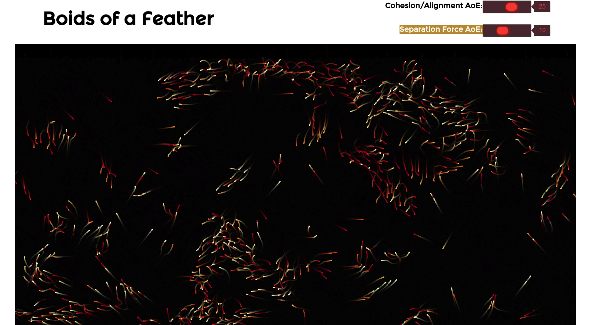

# boids-of-a-feather

 _[Live Demo](https://corleyma.github.io/boids-of-a-feather/)_

## About
An artificial life simulation based on [Craig Reynold's Boids](http://www.red3d.com/cwr/boids/), an algorithm for procedurally generating "flocking" behavior.  This project uses 100% vanilla JS (ES6) and HTMl5 Canvas for responsive rendering.  

The simulation relies on a quadtree for O(_n_ log _n_) spatial indexing, allowing >1000 boid objects to be rendered simultaneously.  The code also makes use of requestAnimationFrame for a smoother experience.

## Use

Right now the interface is minimal, but feel free to manipulate the sliders to adjust the areas of effect for the cohesion, alignment, and separation forces.  Larger values mean each respective force will act on neighboring boids at greater distances from each other.  The defaults are sensible, but the emergent behavior of the flock changes in interesting ways as you tweak the AoEs.
